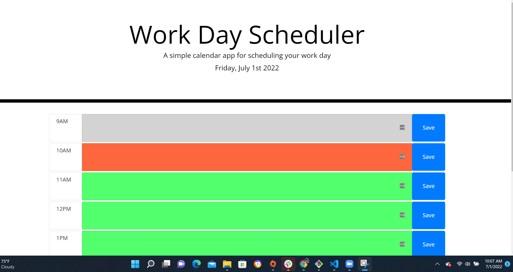

# schedule-tracker

# Description
This is a schedule tracker that tracks a 9-hour work day schedule starting at 9AM. As the time gets later in the day, the time slots change color whether they are before the current hour (grey), after the current hour (green), or the same time as the current hour (red).

Users can save inputs for their schedule in the time slots by clicking the save button next to each time slot. Once the save button is pressed, their input will be saved onto the page even if it is refreshed.

# Picture
This is what the webpage should look like between 10:00 am and 11:00 am.

 

# Link
Go to [ScheduleTracker]() to check out the webpage!